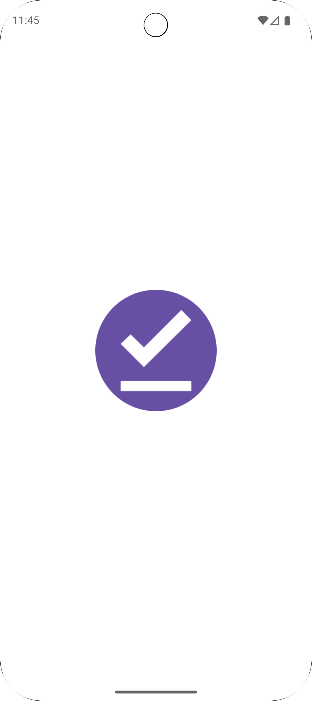
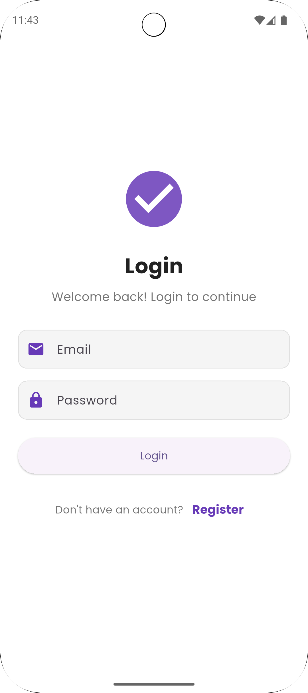
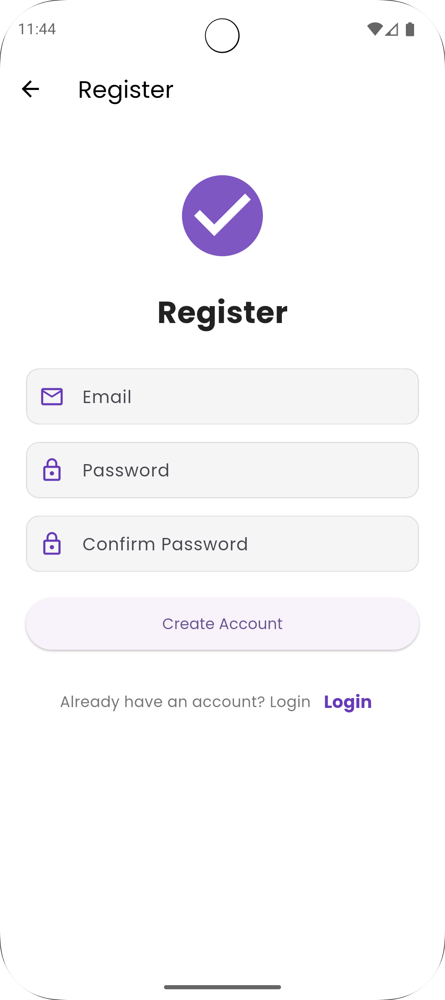
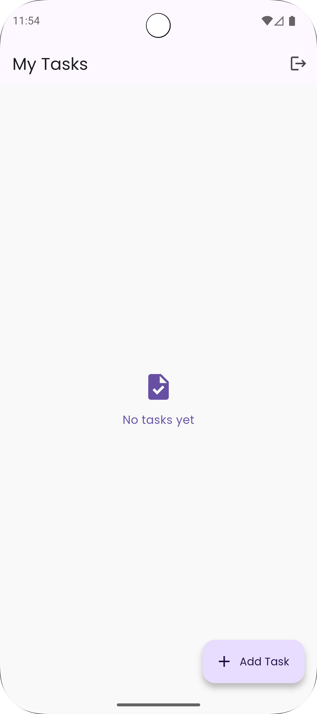
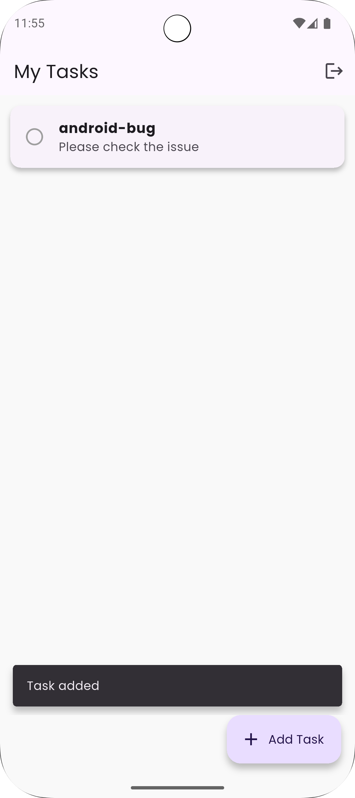
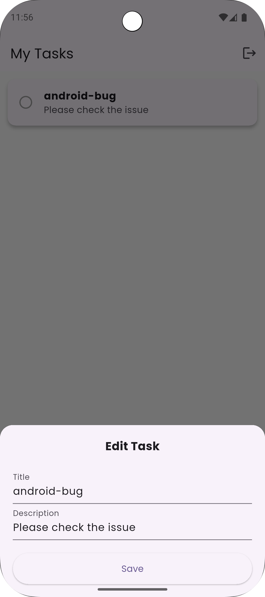
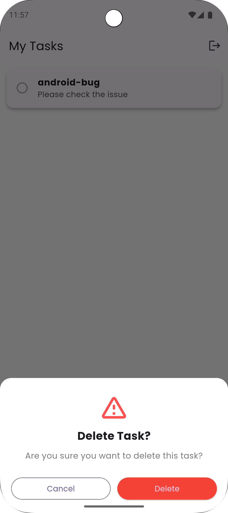

# 📱 TODO Flutter App
Developer: Jitendra Babubhai Parmar
Email: jeet.mobiledeveloper@gmail.com

---

## 🚀 Project Overview
This is a professional Flutter TODO application built using MVVM architecture, Riverpod state management, Firebase Authentication, and Cloud Firestore.  
The app supports real-time task sharing and collaboration, offline usage, retry logic, and a responsive Material 3 UI.

---

## 🌟 Key Features
✅ Email/Password Authentication (Firebase Auth)  
✅ Add / Edit / Delete / Complete tasks  
✅ Share tasks with other registered users via email  
✅ Real-time updates reflected for all collaborators  
✅ Offline mode with auto-sync (RetryService)  
✅ Responsive UI design (mobile/tablet/web)  
✅ MVVM structure with Riverpod ProviderScope  
✅ Reusable UI components (CustomButton, CustomInputField)  
✅ Logout confirmation dialog with safe navigation  
✅ Validation for preventing sharing a task with yourself

---

## 📱 Screenshots

  
  
   

  
  
  

  
  
  

---

## 🔧 Setup Instructions
### 1️⃣ Install Dependencies
### 2️⃣ Configure Firebase
### 3️⃣ Run the App
### 4️⃣ Build Release APK

---

## 🧪 Testing Guide

| Test             | Expected Result                                |
|------------------|------------------------------------------------|
| Create user      | User stored in Firebase Auth                   |
| Add task         | Task visible instantly                         |
| Share task       | Shared user sees task instantly                |
| Self-share       | Error: "You cannot share a task with yourself" |
| Real-time update | Owner sees updates immediately                 |
| Offline mode     | Shows offline banner + syncs once online       |
| Logout           | Shows confirmation dialog                      |
| Responsiveness   | Works on all screen sizes                      |

---

## ✅ Conclusion
This application demonstrates:
- Clean MVVM architecture
- Riverpod for scalable state management
- Realtime Firebase collaboration
- Offline support with retry
- Responsive, modern Material 3 UI

---

## 👨‍💻 Developer
**Jitendra Babubhai Parmar**  
Email: **jeet.mobiledeveloper@gmail.com**